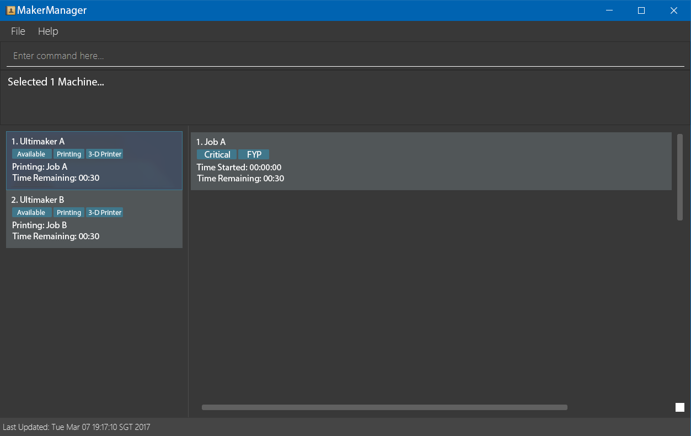

= MakerManager
ifdef::env-github,env-browser[:relfileprefix: docs/]

https://travis-ci.org/CS2113-AY1819S1-T09-1/main[image:https://travis-ci.org/CS2113-AY1819S1-T09-1/main.svg?branch=master[Build Status]]
https://coveralls.io/github/NUSCS2113-T09-1/main?branch=master[image:https://coveralls.io/repos/github/NUSCS2113-T09-1/main/badge.svg?branch=master[Coverage Status]]

ifdef::env-github[]

endif::[]

ifndef::env-github[]
image::images/Ui.png[width="600"]
endif::[]

* This is a desktop maker space manager application. It has a GUI but most of the user interactions happen using a CLI (Command Line Interface).
* It is a Java application intended for maker spaces to manage primarily 3-D prints but has capabilities to handle other forms of manufacturing machines as well.
* It is *written in OOP fashion*. It provides a *reasonably well-written* code that is based on https://github.com/se-edu/addressbook-level4[Address Book (level 4)], a sample java program written for students to learn software engineering.
* Features:
** A GUI for displaying all available machines at a glance.
** More test cases, including automated GUI testing.
** Support for _Build Automation_ using Gradle and for _Continuous Integration_ using Travis CI.

== Site Map

* <<UserGuide#, User Guide>>
* <<DeveloperGuide#, Developer Guide>>
* <<AboutUs#, About Us>>

== Acknowledgements

* Some parts of this sample application were inspired by the excellent http://code.makery.ch/library/javafx-8-tutorial/[Java FX tutorial] by
_Marco Jakob_.
* Libraries used: https://github.com/TestFX/TestFX[TextFX], https://bitbucket.org/controlsfx/controlsfx/[ControlsFX], https://github.com/FasterXML/jackson[Jackson], https://github.com/google/guava[Guava], https://github.com/junit-team/junit5[JUnit5]
* Original code base: https://github.com/se-edu/addressbook-level4[Address Book (level 4)] project created by SE-EDU initiative at https://github.com/se-edu/
== Licence : link:LICENSE[MIT]

